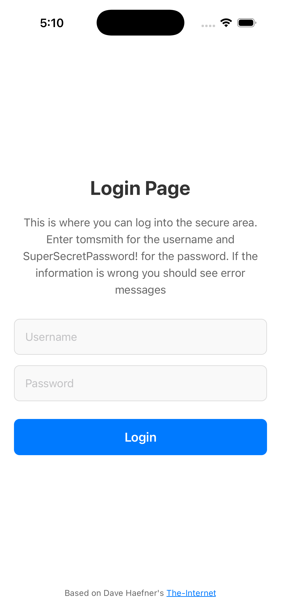
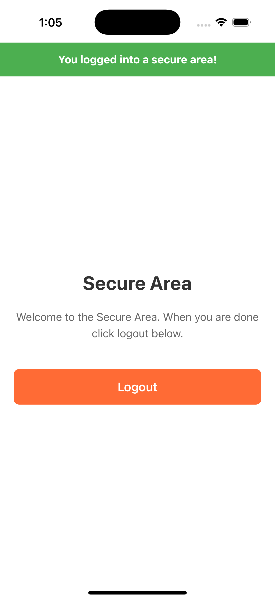

# Detox Demo - React Native iOS + Android App

This project was created for the TestGuild.com talk "**Building a React Native Mobile Test Automation Framework Using Detox + TypeScript**" ( [See Slides](https://www.slideshare.net/slideshow/building-a-react-mobile-automated-test-framework-using-detox-typescript/286364655) ) Given on April 6th, 2026. 

DetoxDemo is a working React Native demo app running on both the iPhone and Android mobile devices that gives examples of:
* [Mobile automation tests](https://github.com/tjmaher/detox-demo/blob/main/e2e/login.test.ts) written in Detox + TypeScript 
* Commonly used test code refactored into [Page Objects](https://github.com/tjmaher/detox-demo/tree/main/e2e/pages)
* Common methods used by Page Objects refactored into a [Base Page](https://github.com/tjmaher/detox-demo/blob/main/e2e/pages/base-page.ts)
* Log reports published after a test run, written like a manual test plan that manual testers can follow
* Pre-written yarn scripts to build and test stored in a [package.json](https://github.com/tjmaher/detox-demo/blob/main/package.json)
* For iOS: detox-allure2-adapter set up in [.detoxrc.js](https://github.com/tjmaher/detox-demo/blob/main/.detoxrc.js) and the [e2e/jest.config.js](https://github.com/tjmaher/detox-demo/blob/main/e2e/jest.config.js) (Allure Reports not working for Android)
* For iOS: [Allure Reports](https://tjmaher.github.io/detox-demo/ios/) configured to show historical data
* For [iOS](https://github.com/tjmaher/detox-demo/actions/workflows/ios-regression.yml) and [Android](https://github.com/tjmaher/detox-demo/blob/main/.github/workflows/android-regression.yml) emulators, CI/CD that triggers tests to run after every pull request is submitted, provided by GitHub Action Workflows 
* A security scanning workflow ([security.yml](https://github.com/tjmaher/detox-demo/blob/main/.github/workflows/security.yml)) that uses [Snyk](https://snyk.io) to scan for vulnerabilities in dependencies and code. Yes, the username (tomsmith) and password (SuperSecretPassword!) are in plain text in our [e2e/credentials](https://github.com/tjmaher/detox-demo/blob/main/e2e/credentials.ts) file, but only because this is a demo project. 
* All test credentials and user-facing messages are managed in the `e2e/data` folder:
  * `e2e/data/credentials.json` — Stores all test credentials (e.g., username and password) used by E2E tests and page objects.
  * `e2e/data/messages.json` — Centralizes all user-facing UI strings and test messages for maintainability and DRY code.
* A working React Native mobile app for iOS and Android [complete with source code](https://github.com/tjmaher/detox-demo/tree/main/src)
* A detailed README documenting the Project Structure, and all the setup for the tools and technologies of this project, along with listing various historical tidbits. 
* Scalable Vector Graphic (SVG) showing the DetoxDemo [iPhone desktop icon](https://github.com/tjmaher/detox-demo/tree/main/assets) and a [setup script](https://github.com/tjmaher/detox-demo/tree/main/scripts) generating various sizes of icons

## Screenshots of LoginPage and SecureArea screens

<div align="center">

<table>
<tr>
<td width="50%" style="padding: 10px;">



*Login Page*

</td>
<td width="50%" style="padding: 10px;">



*Secure Area*

</td>
</tr>
</table>

</div>

## Manual kicking off CI / CD using GitHub Action Workflows for iPhone or Android testing

Want to kick off a job to run all the Login tests in the CI/ CD platform using our GitHub Actions workflow?
* Go to Actions -> [View all Workflows](https://github.com/tjmaher/detox-demo/actions)
* Under the **Actions** column to the left, select [Build & Test iOS](https://github.com/tjmaher/detox-demo/actions/workflows/ios-regression.yml) or [Build & Test Android](https://github.com/tjmaher/detox-demo/actions/workflows/android-regression.yml).
* Select the **\[Run workflow\]** button to see all the choices I set up in the [ios-regression.yml](https://github.com/tjmaher/detox-demo/blob/main/.github/workflows/ios-regression.yml) or the [android-regression.yml](https://github.com/tjmaher/detox-demo/blob/main/.github/workflows/android-regression.yml) configuration file under the on: workflow_dispatch -> inputs
* Say you were a developer that wanted to test out their JIRA-123 branch code before merging, under "Use workflow from" they could choose branch JIRA-123 here instead of running against the main branch.
* Which test suite would you like to run? Login? SecureArea? Default is "all".
* Which iPhone 16 would you like to run the tests on? Regular iPhone 16, Pro, or Pro Max? Or maybe an iPad Mini, Air, or Pro? Or an Android phone such as a Google Pixel 5 or Pixel 6?
* What log level? Select any range from the very verbose "trace", to throwing alerts only if things are "fatal". Default is "info".
* What level of artifacts do you want to capture for logs, screenshots, or videos? All, just failing, or none?
* Do you want to run performance testing with Detox Instruments? We have that option! Still looking how the Wix Incubator's [Detox Instruments](https://github.com/wix-incubator/DetoxInstruments) works with CI/CD. 
* Or you can just scroll down to the bottom and select **\[Run Workflow\]** and kick off the default values set up in [ios-regression.yml](https://github.com/tjmaher/detox-demo/blob/main/.github/workflows/ios-regression.yml)
* A new "Build & Test iOS" run will be created. Feel free to click into the run to see it run through the build -> test -> publish-allure-reports -> cleanup stages where you can see all Homebrew, RubyGems, Cocoapods, Node.js, and Applesimutils are configured and run.
* If you click into the "build" stage, you can see it work through tasks such as "Set up job", "Checkout repository", "Setup Homebrew", "Setup Ruby", "Cache Homebrew and RubyGems", etc. It takes 30 minutes for a Detox-embedded build to be generated. 
* When everything is finished, you can see in the run downloadable artifacts such as videos, logs, screenshots, and the allure-report (if iOS). 
* For iOS: You can also view the Allure Reports at [https://tjmaher.github.io/detox-demo/ios/]

## About DetoxDemo

T.J. Maher will be using DetoxDemo to demonstrate to the [AutomationGuild](https://testguild.com/) in April 2026 how he has put together a mobile automated test framework for [SELF ID](https://selfid.com/) and their React Native mobile application.  

The DetoxDemo app is based on Dave Haefner's [The - Internet / Login](http://the-internet.herokuapp.com/login), a site where T.J. first started teaching himself automation development, writing Selenium + Java tests against that website back in July 2015 with his first toy automation project "Testing The-Internet" ([See Blog](https://www.tjmaher.com/2015/06/simple-manipulation-of-login-page.html)). 

DetoxDemo uses Wix's [Detox](https://wix.github.io/Detox/), a grey-box end-to-end automated testing framework built to test React Native applications. Reports are produced via [Allure Reports](https://allurereport.org/) by integrating The Wix Community's [detox-allure2-reporter](https://github.com/wix-incubator/detox-allure2-adapter). CI/CD Test reports produced by a GitHub Actions workflow are published at [https://tjmaher.github.io/detox-demo/ios/](https://tjmaher.github.io/detox-demo/ios/). 

DetoxDemo, the app under test for this project, was constructed by GitHub Copilot via prompts from T.J. Maher. The automation framework was lovingly crafted by hand, with locators artisinally wrapped in page objects by T.J. Maher. You can read more about the hectic journey T.J. had with GitHub Copilot creating the app under test in T.J.'s LinkedIn article: [First Time Using GitHub Copilot to Create a ReactNative LoginPage app. What Could Go Wrong?](https://www.linkedin.com/pulse/first-time-using-github-copilot-create-reactnative-app-maher-jr--1iaoe/)

## About the Author

T.J. has been a Software Test Engineer at [SELF ID](https://selfid.com/) since July 2025 testing the SELF ID React Native mobile app ( [Download iOS app](https://apps.apple.com/us/app/self-id/id1663745416) ) where users can create, store, and share their digital identity. 

T.J. Maher has been blogging about writing test automation for over ten years on his site, [Adventures in Automation](https://www.tjmaher.com/2015/06/simple-manipulation-of-login-page.html), writing [toy projects](https://www.tjmaher.com/p/programming-projects.html) to help him practice what he is doing on the job, and writing [articles](https://www.tjmaher.com/p/media.html) and [courses](https://testautomationu.applitools.com/capybara-ruby/) about test automation. Other coding projects can be found at https://github.com/tjmaher . T.J. is @tjmaher1 on [BlueSky](https://bsky.app/profile/tjmaher1.bsky.social), [LinkedIn](https://www.linkedin.com/in/tjmaher1/), and [Twitter](https://x.com/tjmaher1).

If you find this project helpful, feel free to copy it and use it for your own education. Like it? Give a shout out and tag me [on LinkedIn](https://www.linkedin.com/in/tjmaher1/)! 

## DetoxDemo Features

### Login Screen
- **Heading**: "Login Page"
- **Instructions**: Guided instructions with username and password information
- **Username Input**: Text input for username (use "tomsmith")
- **Password Input**: Secure text input for password (use "SuperSecretPassword!")
- **Login Button**: Triggers authentication
- **Error Banner**: Red banner with white bold text for invalid credentials: "Your username is invalid!"
- **Success Messages**: Green banners illustrating a successful logout.

### Secure Area Screen
- **Heading**: "Secure Area" 
- **Welcome Text**: "Welcome to the Secure Area. When you are done click logout below."
- **Success Banner**: Green banner with "You logged into a secure area!"
- **Logout Button**: Returns to login screen with success message

### Navigation Flow
1. Login Screen → (valid credentials) → Secure Area Screen
2. Secure Area Screen → (logout) → Login Screen (with logout success message)
3. Login Screen → (invalid credentials) → Error message display

### Test Reporting
- **Allure Reports**: Comprehensive test reports with visual artifacts for debugging
- **Live Results**: View test execution results at https://tjmaher.github.io/detox-demo/ios/
- **CI Integration**: Automated report generation on GitHub Actions with iPhone 16 simulator
- **Failure Artifacts**: Screenshots, videos, and logs captured

## Test Credentials
- **Username**: `tomsmith`
- **Password**: `SuperSecretPassword!`

## Tools & Technologies

### React Native

React Native is an open-source framework created by Facebook - now Meta - for building mobile applications using JavaScript and the React library, a JavaScript library released in March 2013, also produced by Facebook, to create user interfaces for web applications. React Native was first released for iOS in March 2015 with the Android version in September 2015. 

### Yarn

This project uses [yarn](https://yarnpkg.com/) as a package manager. Yarn is a JavaScript package manager, developed by Facebook in 2016. Facebook had found npm (Node Package Manager) installed packages sequentially, causing bottlenecks. Yarn implemented parallel downloads, reducing installation times. (See [Yarn: A new package manager for JavaScript](https://engineering.fb.com/2016/10/11/web/yarn-a-new-package-manager-for-javascript/) on Engineering at Meta, October 2016.)

### Detox

Wix's Detox, first released in 2016, is an open-source, gray-box end-to-end (E2E) test automation framework, created at first to test Wix's own React Native mobile application that customers used to create their own websites. Features of Detox include:

* Gray-Box Testing: Unlike "black-box" tools, Detox accesses the app's internal state to monitor asynchronous tasks like network requests, animations, and timers.
* Automatic Synchronization: It automatically waits for the app to be idle before executing the next test action, which eliminates "flakiness" and the need for manual sleep/wait commands.
* Cross-Platform: Supports both iOS and Android, allowing developers to write E2E tests in JavaScript that run on simulators, emulators, and real devices.
* Native Integration: It relies on native drivers (like Espresso for Android and EarlGrey for iOS) to interact directly with the app's native layers.

### Detox CLI

Detox CLI is the command-line interface tool for Detox, the end-to-end testing framework for mobile apps (React Native, iOS, and Android). It provides commands to build apps, run tests, manage test devices/simulators, and configure your testing environment. First released by Wix on March 15, 2017.

Example Detox CLI command:
```
detox test --configuration ios.sim.debug --loglevel info --artifacts-location artifacts --record-logs failing --take-screenshots failing --record-videos none --record-performance none
```

### Detox-Allure2-Adapter

Still in the Alpha stage, detox-allure2-adapter is a bridge between Detox (the mobile E2E testing framework) and jest-allure2-reporter, enables integration of Allure reporting with Detox tests, providing reports with screenshots, videos, device logs, and view hierarchies. The adapter replaces Detox's built-in artifacts manager to integrate with Allure's reporting capabilities.

**Platform Support:**
The Allure adapter is conditionally loaded based on two factors:
- **Windows**: Disabled due to [ESM (ECMAScript Module)](https://nodejs.org/api/esm.html) compatibility issues with jest-allure2-reporter
- **Environment Variable**: Only loads when the custom `DETOX_ENABLE_ALLURE` environment variable I have defined is true.

This means:
- **iOS CI** (`ios-regression.yml`): Sets `DETOX_ENABLE_ALLURE=true`, full Allure reporting with videokitten
- **Android CI** (`android-regression.yml`): Does not set the variable, uses Detox's native artifact capture (videokitten/scrcpy has recording issues on Android emulators)
- **Local Windows development**: Allure disabled regardless of env var due to ESM issues

### Snyk

[Snyk](https://snyk.io/) is a developer security platform that helps find and fix vulnerabilities in code, dependencies, containers, and infrastructure as code. Founded in 2015, Snyk integrates directly into development workflows to scan for security issues before they reach production.

It is free to use for public code repositories. If it's free, it's for me, I'll take three. 

**How we use Snyk in DetoxDemo:**
This project uses Snyk for automated security scanning via the [security.yml](https://github.com/tjmaher/detox-demo/blob/main/.github/workflows/security.yml) GitHub Actions workflow:
- **Dependency Scanning**: Checks `package.json` and `yarn.lock` for known vulnerabilities in npm packages
- **Static Application Security Testing (SAST)**: Scans source code for potential security issues using `snyk code test`
- **GitHub Integration**: Results are uploaded to GitHub Code Scanning and appear in the repository's Security tab

**Resources:**
- [Snyk Documentation](https://docs.snyk.io/)
- [Snyk for JavaScript/Node.js](https://docs.snyk.io/scan-applications/supported-languages-and-frameworks/javascript)
- [GitHub Actions Integration](https://docs.snyk.io/integrate-with-snyk/git-repository-scm-integrations/snyk-github-action)

### Allure Reports

The Allure Framework, created as an internal product by Yandex that was open-sourced, and is now maintained by Qameta Software. According to an [article on Habr.com](https://habr.com/ru/companies/yandex/articles/232697/), published on Yandex's company blog in 2014, they wanted a way to make the automation results transparent not just to the automation engineers, but the entire testing team to make sure that the automation closely match the original manual tests. 

### GitHub Actions, GitHub Workflows & GitHub Pages

[GitHub Actions](https://github.com/features/actions) is GitHub's built-in CI/CD (Continuous Integration/Continuous Deployment) platform, launched in November 2019. It allows you to automate workflows directly in your GitHub repository, triggered by events like pushes, pull requests, or scheduled times.

**GitHub Workflows** are YAML configuration files stored in `.github/workflows/` that define automated processes. Each workflow can contain multiple jobs that run on GitHub-hosted runners (virtual machines with macOS, Ubuntu, or Windows).

**GitHub Pages** is a free static site hosting service that serves content directly from a GitHub repository. It's commonly used to host documentation, project websites, and—in our case—test reports.

**How DetoxDemo uses these technologies:**

| Workflow | Purpose | Link |
|----------|---------|------|
| [ios-regression.yml](https://github.com/tjmaher/detox-demo/blob/main/.github/workflows/ios-regression.yml) | Builds iOS app, runs Detox tests on iPhone simulator, publishes Allure reports | [Run Workflow](https://github.com/tjmaher/detox-demo/actions/workflows/ios-regression.yml) |
| [android-regression.yml](https://github.com/tjmaher/detox-demo/blob/main/.github/workflows/android-regression.yml) | Builds Android app, runs Detox tests on Android emulator | [Run Workflow](https://github.com/tjmaher/detox-demo/actions/workflows/android-regression.yml) |
| [security.yml](https://github.com/tjmaher/detox-demo/blob/main/.github/workflows/security.yml) | Runs Snyk security scans on dependencies and code | [Run Workflow](https://github.com/tjmaher/detox-demo/actions/workflows/security.yml) |

**GitHub Pages in this project:**
- Allure test reports are automatically deployed to GitHub Pages after each iOS test run
- View live reports at: [https://tjmaher.github.io/detox-demo/ios/](https://tjmaher.github.io/detox-demo/ios/)

**Resources:**
- [GitHub Actions Documentation](https://docs.github.com/en/actions)
- [GitHub Actions Workflow Syntax Reference](https://docs.github.com/en/actions/using-workflows/workflow-syntax-for-github-actions)
- [GitHub Pages Documentation](https://docs.github.com/en/pages)

### GitHub Copilot

[GitHub Copilot](https://github.com/features/copilot) is an AI-powered coding assistant developed by GitHub and OpenAI, launched in June 2021. It integrates directly into code editors like VS Code, providing real-time code suggestions, completions, and even generating entire functions based on comments or context.

**WARNING:** All documention and code GitHub Copilot produces must be reviewed with a fine-toothed comb. GitHub Copilot has referenced online docs that do not actually exist, and has hallucinated methods that are not actually there. Even if you did not write the code, T.J. believes that as an automation developer, you are still responsible for every line of code you submit to a code review and every line of code that is approved. 

**How GitHub Copilot was used in DetoxDemo:**
- **App Development**: The entire React Native app under test ([LoginScreen.tsx](https://github.com/tjmaher/detox-demo/blob/main/src/screens/LoginScreen.tsx), [SecureAreaScreen.tsx](https://github.com/tjmaher/detox-demo/blob/main/src/screens/SecureAreaScreen.tsx), [AppIcon.tsx](https://github.com/tjmaher/detox-demo/blob/main/src/components/AppIcon.tsx)) was generated by GitHub Copilot via prompts from T.J. Maher
- **Code Review**: GitHub Copilot's code review feature identified issues like unused imports, redundant code, and typos
- **Documentation**: 
* Assisted with proofreading README documentation
* Continuously updating the Project Structure chart as more uneccesary bells, whistles, and silly doodads are bolted onto this project
* Building out workflow configurations for iOS and Android.

Read more about the journey in T.J.'s LinkedIn article: [First Time Using GitHub Copilot to Create a ReactNative LoginPage app. What Could Go Wrong?](https://www.linkedin.com/pulse/first-time-using-github-copilot-create-reactnative-app-maher-jr--1iaoe/)

**Resources:**
- [GitHub Copilot Documentation](https://docs.github.com/en/copilot)
- [GitHub Copilot in VS Code](https://code.visualstudio.com/docs/copilot/overview)

## Project Structure

```
detox-demo/
├── src/
│   ├── components/
│   │   └── AppIcon.tsx           # Reusable app icon component
│   ├── constants/
│   │   └── strings.json          # Centralized UI text strings and messages
│   └── screens/
│       ├── LoginScreen.tsx       # Login Page emulating The-Internet
│       └── SecureAreaScreen.tsx  # Secure Area reached after successful login
│
├── e2e/                          # Detox end-to-end testing framework
│   ├── data/                     # Centralized test data and messages
│   │   ├── credentials.json      # Test credentials (username, password)
│   │   └── messages.json         # All user-facing UI/test messages
│   ├── pages/                    # Page Objects
│   │   ├── base-page.ts          # Base page object with common methods
│   │   ├── login-page.ts         # Login screen page object
│   │   └── secure-area-page.ts   # Secure area page object
│   ├── constants.ts              # Time constants (TEN_SECONDS, FIVE_SECONDS, etc.)
│   ├── init.ts                   # Detox initialization and setup
│   ├── jest.config.js            # Jest configuration for Detox tests with Allure integration
│   ├── login.test.ts             # Login functionality test suite
│   └── securearea.test.ts        # Secure area test suite
│
├── .github/
│   └── workflows/
│       ├── android-regression.yml # CI/CD pipeline for Android emulator testing
│       ├── ios-regression.yml    # CI/CD pipeline with iPhone 16 Pro simulator
│       └── security.yml          # Snyk security scanning for vulnerabilities
│
├── ios/                          # iOS native project files and Xcode configuration
│   ├── build/                    # Xcode build output (generated)
│   │   └── Build/Products/Debug-iphonesimulator/
│   │       └── DetoxDemo.app     # Built app for Detox testing
│   └── DetoxDemo/
│       └── Images.xcassets/
│           └── AppIcon.appiconset/ # Custom app icons
│
├── android/                      # Android native project files and Gradle configuration
│   ├── app/
│   │   ├── build.gradle          # App-level Gradle build configuration
│   │   └── src/
│   │       ├── main/
│   │       │   ├── AndroidManifest.xml
│   │       │   └── res/          # Android resources (icons, layouts, etc.)
│   │       └── androidTest/
│   │           └── java/com/detoxdemo/
│   │               └── DetoxTest.java  # Detox test bootstrapping for Android
│   ├── build.gradle              # Project-level Gradle configuration
│   ├── gradle.properties         # Gradle settings
│   └── gradlew                   # Gradle wrapper script
│
├── scripts/
│   └── generate-tj-icon.js       # Icon generation script 
│
├── assets/                       # Static assets and resources
│   └── app-icon.svg              # SVG source for app icon generation
│
├── artifacts/                    # Detox test artifacts (generated on test failures)
│   ├── attachments/              # Device logs from failed tests
│   └── ios.sim.debug.*/          # Per-test-run artifacts (screenshots, videos, logs)
│
├── allure-results/              # Allure test results JSON files (generated)
├── allure-report/               # Generated Allure HTML reports (generated)
│
├── node_modules/                # Node.js dependencies 
├── .detoxrc.js                  # Detox configuration targeting iPhone 16 simulator
├── jest.config.js               # React Native unit tests configuration
├── package.json                 # Dependencies and yarn scripts for detox:ios commands
├── yarn.lock                    # Locked dependency versions
├── Gemfile                      # Ruby dependencies for CocoaPods
├── Gemfile.lock                 # Locked Ruby gem versions
└── README.md                    
```

## Run DetoxDemo Locally:

### Prerequisites
- Node.js (>= 20)
- Xcode (for iOS development)
- iOS Simulator (such as iPhone 16 Pro, used in this project)
- React Native development environment ([Setup Guide](https://reactnative.dev/docs/set-up-your-environment))
- Homebrew (for macOS dependencies)

### Download DetoxDemo

* Go to **<>Code** => Select "HTTPS" and copy the URL.
* Open your Mac Terminal, find the subdirectory where you wish to install code, and: git clone https://github.com/tjmaher/detox-demo.git
* Change the directory to where DetoxDemo was installed: cd detox-demo

### Install Dependencies

```bash
# Install Node.js dependencies
yarn install

# Install Ruby dependencies for CocoaPods
bundle install
```

### Setup for iOS

[Set Up Your React Native Environment](https://reactnative.dev/docs/set-up-your-environment) before proceeding.

**Install [CocoaPods](https://cocoapods.org/) dependencies:**
* Go into the ios directory, install pod, then go back to the root directory: cd ios && pod install && cd ..

For more information, visit [CocoaPods Getting Started guide](https://guides.cocoapods.org/using/getting-started.html).

**Install [Detox CLI](https://wix.github.io/Detox/docs/19.x/api/detox-cli/) globally:**
* yarn global add detox-cli

**Install [applesimutils](https://github.com/wix/AppleSimulatorUtils), for Detox iOS testing:**
* brew tap wix/brew
* brew install applesimutils

### Setup for Android

**This project follows the [official Detox Project Setup Guide for Android](https://wix.github.io/Detox/docs/introduction/project-setup).**

**Summary of required steps:**
1. Install prerequisites: JDK 11+, Android Studio, ANDROID_HOME env var
2. Create an AVD in Android Studio (API 33+ recommended)
3. Patch Gradle build scripts:
   - Add Detox maven repo to `android/build.gradle`:
     ```groovy
     allprojects {
       repositories {
         maven { url "$rootDir/../node_modules/detox/Detox-android" }
         // ...existing code...
       }
     }
     ```
   - In `android/app/build.gradle`, ensure:
     - `testInstrumentationRunner 'androidx.test.runner.AndroidJUnitRunner'` in `defaultConfig`
     - `testBuildType System.getProperty('testBuildType', 'debug')`
     - Add Detox proguard rules to release build type:
       ```groovy
       proguardFile "${rootProject.projectDir}/../node_modules/detox/android/detox/proguard-rules-app.pro"
       ```

   **See official Detox documentation:**
   - [Patch Gradle build scripts](https://wix.github.io/Detox/docs/introduction/project-setup/#patch-gradle-build-scripts)

4. Create required files:
   - `android/app/src/androidTest/java/com/detoxdemo/DetoxTest.java` (see official docs for template)
   - `android/app/src/main/res/xml/network_security_config.xml` (see official docs for template)
   - Reference the network config in `AndroidManifest.xml`:
     ```xml
     <application ... android:networkSecurityConfig="@xml/network_security_config">
     ```

   **See official Detox documentation:**
   - [Create required files](https://wix.github.io/Detox/docs/introduction/project-setup/#create-required-files)

5. **Metro must be running before tests:**
   - Start Metro: `yarn start` (in a separate terminal)
6. Build and test:
   - Build: `yarn detox:build:android`
   - Test: `yarn detox:test:android`

**Note:** iOS is the primary platform for this project. Android support is provided for local development and demonstration, following the official Detox documentation. Always refer to the [Detox Project Setup Guide](https://wix.github.io/Detox/docs/introduction/project-setup) for the most up-to-date instructions.

## Setup for macOS Local Development

This guide covers setting up DetoxDemo for local development and testing on macOS (MacBook).

### System Requirements
- macOS 13 (Ventura) or later
- Xcode 15+ (for iOS development)
- Node.js 20+ (LTS recommended)
- Homebrew
- 16GB RAM minimum (8GB+ free)
- 50GB+ free disk space (for Xcode, simulators, and Android SDK)

### Installation Steps

**1. Install Homebrew** (if not already installed)
```bash
/bin/bash -c "$(curl -fsSL https://raw.githubusercontent.com/Homebrew/install/HEAD/install.sh)"
```

**2. Install Node.js and Yarn**
```bash
# Install Node.js via Homebrew
brew install node

# Verify installation
node --version
npm --version

# Install Yarn
npm install --global yarn

# Verify Yarn
yarn --version
```

**3. Install Xcode** (for iOS development)
- Download Xcode from the Mac App Store
- Open Xcode and accept the license agreement
- Install Xcode Command Line Tools:
  ```bash
  xcode-select --install
  ```
- Open Xcode → Settings → Platforms → Install iOS Simulator

**4. Install Ruby and CocoaPods**
```bash
# macOS comes with Ruby, but you may want to use rbenv for version management
brew install rbenv ruby-build

# Add rbenv to your shell (add to ~/.zshrc or ~/.bash_profile)
echo 'eval "$(rbenv init -)"' >> ~/.zshrc
source ~/.zshrc

# Install Ruby 3.2+
rbenv install 3.2.0
rbenv global 3.2.0

# Verify Ruby
ruby --version

# Install CocoaPods
gem install cocoapods

# Verify CocoaPods
pod --version
```

**5. Install Android SDK** (for Android development)
```bash
# Install Android Studio via Homebrew
brew install --cask android-studio
```
- Run Android Studio and complete the setup wizard
- Go to **Android Studio** → **Settings** → **Appearance & Behavior** → **System Settings** → **Android SDK**
- Install Android SDK API level 33+
- Add environment variables to `~/.zshrc`:
  ```bash
  export ANDROID_HOME=$HOME/Library/Android/sdk
  export PATH=$PATH:$ANDROID_HOME/emulator
  export PATH=$PATH:$ANDROID_HOME/platform-tools
  ```
- Reload your shell: `source ~/.zshrc`

**6. Create Android Virtual Device (AVD)**
- Open Android Studio
- Go to **Tools** → **Device Manager**
- Click **Create device**
- Select a device (e.g., **Pixel 5** or **Pixel 8**)
- Click **Next** and select **API 33** or higher
- Click **Finish**
- Update `.detoxrc.js` with your AVD name if different

**7. Clone and Setup DetoxDemo**
```bash
# Clone the repository
git clone https://github.com/tjmaher/detox-demo.git
cd detox-demo

# Install dependencies
yarn install

# Install iOS dependencies
cd ios && pod install && cd ..

# Install Detox CLI globally
yarn global add detox-cli

# Verify Detox installation
detox --version
```

### Running iOS Tests Locally on macOS

**Step 1: Start Metro** (in a new terminal)
```bash
cd detox-demo
yarn start
```

**Step 2: Build the iOS App**
```bash
yarn detox:build:ios
```

**Step 3: Run iOS Tests**
```bash
yarn detox:test:ios
```

Or run both build and test in one command:
```bash
yarn detox:ios
```

### Running Android Tests Locally on macOS

**Step 1: Start Android Emulator**
```bash
# List available AVDs
emulator -list-avds

# Start an AVD (replace with your AVD name)
emulator -avd Pixel_5_API_33
```

**Step 2: Start Metro** (in a new terminal)
```bash
cd detox-demo
yarn start
```

**Step 3: Build the Android App**
```bash
yarn detox:build:android
```

**Step 4: Run Android Tests**
```bash
yarn detox:test:android
```

### Troubleshooting on macOS

**Issue: `pod install` fails**
- Update CocoaPods: `gem update cocoapods`
- Clear CocoaPods cache: `pod cache clean --all`
- Delete `ios/Pods` and `ios/Podfile.lock`, then run `pod install` again

**Issue: Xcode build fails**
- Ensure Xcode Command Line Tools are installed: `xcode-select --install`
- Open iOS project in Xcode and verify signing/team settings
- Clean build: `cd ios && xcodebuild clean && cd ..`

**Issue: Simulator not found**
- Open Xcode → Settings → Platforms → Download the required iOS simulator
- List available simulators: `xcrun simctl list devices`

**Issue: Android emulator won't start**
- Ensure Intel HAXM or ARM64 support is enabled
- Check if another emulator/VM is running
- Try: `emulator -avd <AVD_NAME> -gpu host`

**Issue: Metro bundler connection issues**
- Kill any existing Metro processes: `pkill -f metro`
- Clear Metro cache: `yarn start --reset-cache`

### Allure Reporting on macOS

```bash
# Install Allure CLI for local report generation
brew install allure

# Generate and view reports locally after running tests
allure generate allure-results --clean -o allure-report
allure open allure-report
```

## Setup for Windows 11 Local Development

This guide covers setting up DetoxDemo for local development and testing on Windows 11.

### System Requirements
- Windows 11 (21H2 or later)
- Node.js 20+ (LTS recommended)
- Git for Windows
- 16GB RAM minimum (8GB+ free)
- 50GB+ free disk space (for Android SDK and emulator images)

### Installation Steps

**1. Install Node.js and Yarn**
- Download and install Node.js 20+ LTS from https://nodejs.org/
- Verify installation: `node --version` and `npm --version`
- Install Yarn: `npm install --global yarn`
- Verify Yarn: `yarn --version`

**2. Install Ruby and CocoaPods** (for iOS development on macOS or cross-platform testing)
- Download and install RubyInstaller from https://rubyinstaller.org/ (includes Ruby and Gem)
- Verify Ruby: `ruby --version`
- Install CocoaPods: `gem install cocoapods`
- Verify CocoaPods: `pod --version`

**3. Install Android SDK**
- Download and install Android Studio from https://developer.android.com/studio
- Run Android Studio and complete the setup wizard
- Go to **File** → **Settings** → **Appearance & Behavior** → **System Settings** → **Android SDK**
- Install Android SDK API level 33+ (required for Detox)
- Add `ANDROID_HOME` environment variable:
  ```powershell
  $androidSdkPath = "$env:LOCALAPPDATA\Android\Sdk"
  [Environment]::SetEnvironmentVariable("ANDROID_HOME", $androidSdkPath, "User")
  ```
- Restart PowerShell or reload the environment variables:
  ```powershell
  $env:ANDROID_HOME = "$env:LOCALAPPDATA\Android\Sdk"
  ```

**4. Create Android Virtual Device (AVD)**
- Open Android Studio
- Go to **Tools** → **Device Manager**
- Click **Create device**
- Select a device (e.g., **Pixel 5** or **Pixel 8**)
- Click **Next** and select **API 33** or higher
- Click **Next** and name it (note the exact name)
- Click **Finish**
- Update `.detoxrc.js` with your AVD name if different from `Pixel_5_API_33`

**5. Clone and Setup DetoxDemo**
```powershell
# Clone the repository
git clone https://github.com/tjmaher/detox-demo.git
cd detox-demo

# Install dependencies
yarn install

# Install Detox CLI globally
yarn global add detox-cli

# Verify Detox installation
detox --version
```

**6. Verify ANDROID_HOME**
```powershell
# Check if ANDROID_HOME is set
echo $env:ANDROID_HOME

# Should output something like: C:\Users\YourUsername\AppData\Local\Android\Sdk
```

### Running Tests Locally on Windows 11

**For iOS (requires macOS):**
- This project's iOS tests can only run on macOS

**For Android:**

**Step 1: Start Android Emulator**
```powershell
# List available AVDs
emulator -list-avds

# Start an AVD (replace 'Pixel_5_API_33' with your AVD name)
emulator -avd Pixel_5_API_33
```

**Step 2: Start Metro (in a new PowerShell terminal)**
```powershell
cd detox-demo
yarn start
```

**Step 3: Build the Android App**
```powershell
yarn detox:build:android
```

**Step 4: Run Tests**
```powershell
yarn detox:test:android
```

Or run both build and test in one command:
```powershell
yarn detox:android
```

### Troubleshooting on Windows 11

**Issue: `java` is not recognized**
- Install Java Development Kit (JDK 11+)
- Add JDK to `PATH`: `setx PATH "%PATH%;C:\Program Files\Java\jdk-XX\bin"`
- Restart PowerShell

**Issue: `adb` is not recognized**
- Verify `ANDROID_HOME` is set: `echo $env:ANDROID_HOME`
- Add Android tools to PATH: `setx PATH "%PATH%;$env:ANDROID_HOME\platform-tools"`
- Restart PowerShell

**Issue: Emulator won't start**
- Ensure AMD/Intel virtualization is enabled in BIOS
- Check if another emulator/VM is running
- Try: `emulator -avd <AVD_NAME> -writable-system`

**Issue: App times out during tests**
- Ensure Metro is running (`yarn start`)
- Check emulator has enough memory (increase in AVD settings if needed)
- Verify app can launch manually: `npx react-native run-android`

**Issue: ESM/Path errors on Windows**
- Ensure you're using Node.js 20+: `node --version`
- Delete `node_modules` and `yarn.lock`, then run: `yarn install`
- Use PowerShell (not CMD) for terminal commands

### Allure Reporting Setup (MacOS and iOS only)

**Allure Reporting does not work with Windows 11 and Android for Detox tests.**

**Reasons:**
- The detox-allure2-adapter and jest-allure2-reporter are only supported for iOS testing on macOS.
- Detox Android integration does not generate the required artifacts for Allure (screenshots, videos, device logs) on Windows 11.
- The Allure CLI and reporting tools are designed for Unix-like environments and may not function correctly on Windows.
- Detox’s artifact manager and Allure integration rely on macOS/iOS-specific APIs and file paths.
- Official documentation and community support for Allure reporting with Detox is limited to iOS/macOS.

**Workaround:**
You can still run Detox Android tests on Windows 11, but Allure reports will not be generated or viewable for those runs. For full Allure reporting, use iOS testing on macOS.

## Build and Run Tests

### Build the DetoxDemo app

To Build the app, you could do it the long way in Detox CLI:
* detox build --configuration ios.sim.debug

Or you can use the shortcuts set up in the package.json: 
* yarn detox:build:ios

### Run iOS Tests

**Step 1: Start Metro**

Run **Metro**, the JavaScript build tool for React Native.

To start the Metro dev server, run:

```sh
# Using yarn
yarn start

```
**Step 2: Run the Tests Locally**

Run all the tests using Detox CLI: 
* detox test --configuration ios.sim.debug

Run only the LoginPage tests in login.test.ts: 
* detox test --configuration ios.sim.debug e2e/login.test.ts

... Or you can run shortcuts to run the tests, found in the package.json file in the root directory such as:
* yarn detox:test:ios

### Run Android Tests

This project follows the [official Detox Project Setup Guide](https://wix.github.io/Detox/docs/introduction/project-setup). The Android setup requires specific configuration files and test bootstrapping that are included in this project.

**Required Files for Android Testing** (already configured in this project):
- `android/app/src/androidTest/java/com/detoxdemo/DetoxTest.java` - Auxiliary test file required by Detox
- `android/app/src/main/res/xml/network_security_config.xml` - Allows WebSocket communication with test runner
- Proper `testInstrumentationRunner` configuration in `android/app/build.gradle`
- Detox Maven repository in `android/build.gradle`

**Step 1: Start the Android Emulator**
* Open Android Studio
* Go to **Device Manager**
* Select your AVD (e.g., Pixel_5_API_33) and click the play button to start it
* Wait for the emulator to fully boot

**Step 2: Start Metro** (Required - JavaScript bundler must be running)
* In a new terminal, run: `yarn start`
* Metro will start on port 8081 and watch for changes
* Keep this terminal open while running tests

**Step 3: Build the Android App**
* In a new terminal, run: `yarn detox:build:android`
* This compiles the app and test instrumentation

**Step 4: Run the Tests**

Run all the tests using Detox CLI:
* `yarn detox:test:android`

Run only the LoginPage tests in login.test.ts:
* `detox test --configuration android.emu.debug e2e/login.test.ts`

Or build and test in one command:
* `yarn detox:android`

**Expected Test Results:**
All 5 tests should pass:
- Secure Area Flow: 2 tests
- Login Flow: 3 tests

### Debug using Detox REPL (Optional)

Detox has a REPL mode, a Run - Evaluate - Print Loop where you can investigate your running app. For more information, see [Wix Detox: Debugging with Detox REPL](https://wix.github.io/Detox/docs/guide/detox-repl)

Let's say you wanted to run all failing LoginPage tests in REPL mode:
* detox test --configuration ios.sim.debug e2e/login.test.ts --repl=auto

Some things you can do in REPL Mode:
```
.detox> .help
.break     Sometimes you get stuck, this gets you out
.dumpxml   Print view hierarchy XML
.exit      Exit the REPL
.help      Print this help message
```

### View the Results

You should see your new app running in iOS Simulator or Android Emulator.

  Login Flow
  ```
    ✓ Verify Heading and Instruction Text (1550 ms)
    ✓ Invalid credentials displays error message (3958 ms)
    ✓ Successful login to Secure Area displays success message (5159 ms)
    ✓ Logout from Secure Area returns to Login Page (5779 ms)

    Test Suites: 1 passed, 1 total
    Tests:       4 passed, 4 total
    Snapshots:   0 total
    Time:        27.516 s, estimated 39 s
  ```  

## Test Reports

At the end of each test, a test report is outputed to the console log. A test report looks like a manual test plan a software tester can use to debug any failures:

```
==Secure Area Flow:  Verify all Secure Area elements==
 
LoginPage: Verifying Page is Loaded
LoginPage: Logging in as tomsmith / SuperSecretPassword!
 
LoginPage: Verifying Page is Loaded
  * Entering Username: tomsmith
  * Entering Password: SuperSecretPassword!
  * Tapping Login Button
 
SecureArea: Verifying Page is Loaded
  * Verifying Heading: 'Secure Area'
  * Verifying Body Text
  * Expected Text: Welcome to the Secure Area. When you are done click logout below.
  * Verifying Success Banner
  * Expected Text: You logged into a secure area!
  * Verifying Logout Button is Visible
 ================================
 ```

## More about the GitHub Actions Workflow CI/CD Pipeline 

The GitHub Actions Workflow Pipeline is configured by [.github/workflows/ios-regression.yml](https://github.com/tjmaher/detox-demo/blob/main/.github/workflows/ios-regression.yml).

It takes 30 minutes to build the Detox app and 10 minutes to set up the simulator and run all tests. 

### Pipeline Stages
1. **Build Stage**: Sets up macOS environment, installs dependencies (Node.js 20, Ruby 3.2, CocoaPods), and builds the iOS app for default iPhone 16 Pro simulator
2. **Test Stage**: Boots default iPhone 16 Pro simulator running Detox tests collecting artifacts such as screenshots, videos, logs
3. **Allure Report Stage**: Generates HTML test reports, deploying to GitHub Pages at https://tjmaher.github.io/detox-demo/ios/
4. **Cleanup Stage**: Removes temporary files and shuts down simulators

### Key Features
- **Triggered on**: Push to main, pull requests, manual dispatch with test suite selection
- **iPhone 16 Focus**: Uses iPhone 16 simulator if default is selected
- **Failure Handling**: Each stage only runs if prerequisites succeed, with proper error handling
- **Visual Artifacts**: Captures screenshots and videos using Wix's [detox-allure2-adapter](https://github.com/wix-incubator/detox-allure2-adapter)
- **Live Reports**: Publishes test results to GitHub Pages for easy access

### Security Scanning with Snyk

The project includes a security scanning workflow ([security.yml](https://github.com/tjmaher/detox-demo/blob/main/.github/workflows/security.yml)) that uses [Snyk](https://snyk.io) to scan for vulnerabilities in dependencies and code.

**Features:**
- **Dependency Scanning**: Checks `package.json` and `yarn.lock` for vulnerable npm packages
- **Static Application Security Testing (SAST)**: Scans source code for security issues
- **GitHub Code Scanning Integration**: Results appear in the repository's Security tab

**Setup Required:**
The `SNYK_TOKEN` is stored in **GitHub Settings** → **Secrets and variables** → **Actions** as a repository secret. To set up your own:
1. Sign up at [snyk.io](https://snyk.io) (free for open source)
2. Go to **Account Settings** → **API Token** and copy your token
3. Add it as a repository secret named `SNYK_TOKEN`


# Troubleshooting

If you're having issues see the [Troubleshooting React Native application](https://reactnative.dev/docs/troubleshooting) page.

## Test Reporting with Allure

This project uses [detox-allure2-adapter](https://github.com/wix-incubator/detox-allure2-adapter) to generate visual test reports with screenshots, videos, and logs captured on test failures.

### Key Features
- **HTML Reports**: Rich test execution reports with pass/fail details
- **Visual Artifacts**: Screenshots and videos captured only on failures
- **Device Logs**: iOS simulator logs for debugging
- **CI Integration**: Automatic report generation and deployment

### Configuration
The adapter is configured in `.detoxrc.js` and `e2e/jest.config.js` to capture artifacts on failing tests and generate results in `allure-results/`.  

### Viewing Reports

**Local Development:**
```bash
brew install allure
allure generate allure-results --clean -o allure-report
allure open allure-report
```

**CI/CD Pipeline:**
View live reports at: https://tjmaher.github.io/detox-demo/ios/

The GitHub Actions workflow automatically runs tests, captures failure artifacts, and publishes reports to GitHub Pages for easy access to test results and debugging

## What is Metro?

**Metro** is the JavaScript bundler for React Native applications, the build tool that transforms React Native code into JavaScript bundles that can run on iOS and Android devices.

### Key Functions in DetoxDemo

**Development Server**: Metro runs a local development server on port 8081, that serves your JavaScript code to the iOS Simulator during development and testing.

**Code Transformation**: Converts modern JavaScript/TypeScript, JSX, and React Native components into optimized JavaScript that iOS can execute.

**Hot Reloading**: Enables fast development by automatically updating your app when you make code changes without losing app state.

**Bundle Generation**: Creates production-ready JavaScript bundles for release builds.

### Metro in Your Detox Tests

When running Detox tests, Metro must be running to serve your app's JavaScript code to the iOS Simulator:

```bash
# Metro starts automatically with this command
yarn start

# Or start with cache reset for clean testing
yarn start --reset-cache
```

### Common Metro Issues

**"No script URL provided"**: This error occurs when:
- Metro bundler isn't running during test execution
- iOS app can't connect to Metro server
- JavaScript bundle isn't embedded in the app for CI

**Port Conflicts**: Metro defaults to port 8081. If blocked:
```bash
# Start Metro on different port
yarn start --port 8082
```
## Detox Instruments

DetoxInstruments, part of the [Wix Incubator](https://github.com/wix-incubator/DetoxInstruments), is a macOS performance profiling tool from Wix for iOS apps. It captures CPU, memory, disk, network, and FPS metrics during app execution.

### Key Features
* Visual timeline of performance metrics
* Integration with Detox test execution
* Automated performance regression detection in CI/CD
* Usage in DetoxDemo
* The [Build & Test iOS](https://github.com/tjmaher/detox-demo/actions/workflows/ios-regression.yml) GitHub Actions workflow has a record_performance option.

When set to 'all', it records performance profiles to help identify:
* Slow UI interactions
* Memory leaks
* Network bottlenecks
* App startup time issues
